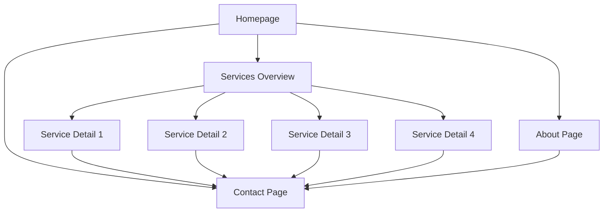

# Technical Design Document

## Overview

This document provides the technical design for a Next.js-based web application for a cybersecurity services company. The application serves as the company's primary web presence, built with Next.js 14+ using the App Router architecture, TypeScript, and Tailwind CSS.

The design emphasizes modern web development practices including static site generation for optimal performance, responsive design for cross-device compatibility, and comprehensive SEO optimization. The application follows a component-based architecture that promotes reusability and maintainability.

### Key Design Goals

- **Performance**: Leverage Next.js static generation and image optimization for fast page loads
- **Accessibility**: Ensure WCAG-compliant navigation and form interactions
- **Maintainability**: Use TypeScript and modular component architecture
- **SEO**: Implement comprehensive metadata and semantic HTML structure
- **Responsiveness**: Support devices from 320px to 1920px width

## Architecture

### Application Structure

The application follows Next.js 14 App Router conventions with a file-based routing system:

```
app/
├── layout.tsx              # Root layout with navigation and footer
├── page.tsx                # Homepage
├── about/
│   └── page.tsx            # About page
├── services/
│   ├── page.tsx            # Services overview
│   └── [slug]/
│       └── page.tsx        # Individual service pages
├── contact/
│   └── page.tsx            # Contact page
└── api/
    └── contact/
        └── route.ts        # Contact form API endpoint

components/
├── navigation/
│   ├── Header.tsx          # Main navigation component
│   ├── MobileMenu.tsx      # Mobile navigation menu
│   └── NavLink.tsx         # Navigation link component
├── home/
│   ├── HeroSection.tsx     # Homepage hero
│   ├── ServicesOverview.tsx # Services preview
│   ├── CTASection.tsx      # Call-to-action
│   └── TrustIndicators.tsx # Certifications/badges
├── services/
│   ├── ServiceCard.tsx     # Service preview card
│   └── ServiceDetail.tsx   # Service detail view
├── contact/
│   └── ContactForm.tsx     # Contact form component
├── shared/
│   ├── Footer.tsx          # Footer component
│   └── Button.tsx          # Reusable button component
└── ui/
    ├── Input.tsx           # Form input component
    └── TextArea.tsx        # Form textarea component

lib/
├── services.ts             # Service data and utilities
├── validation.ts           # Form validation logic
└── metadata.ts             # SEO metadata utilities

types/
├── service.ts              # Service type definitions
└── contact.ts              # Contact form type definitions
```

### Technology Stack

- **Framework**: Next.js 14+ (App Router)
- **Language**: TypeScript 5+
- **Styling**: Tailwind CSS 3+
- **Form Handling**: React Hook Form with Zod validation
- **Image Optimization**: Next.js Image component
- **Deployment**: Vercel (recommended) or any Node.js hosting

### Rendering Strategy

- **Static Generation (SSG)**: Homepage, About, Services overview, individual service pages
- **Client-Side Rendering**: Contact form interactions, mobile menu toggle
- **API Routes**: Contact form submission endpoint

## Components and Interfaces

### Core Components

#### Header Component

```typescript
interface HeaderProps {
  currentPath: string;
}

// Displays main navigation with logo and links
// Responsive: Desktop horizontal menu, mobile hamburger menu
// Highlights active page based on currentPath
```

#### MobileMenu Component

```typescript
interface MobileMenuProps {
  isOpen: boolean;
  onClose: () => void;
  currentPath: string;
}

// Slide-out menu for mobile devices
// Displays when screen width < 768px
// Includes all navigation links with active state
```

#### HeroSection Component

```typescript
interface HeroSectionProps {
  title: string;
  subtitle: string;
  ctaText: string;
  ctaLink: string;
}

// Full-width hero with company value proposition
// Includes primary call-to-action button
// Background image with overlay for text readability
```

#### ServicesOverview Component

```typescript
interface Service {
  id: string;
  title: string;
  description: string;
  icon: string;
  slug: string;
}

interface ServicesOverviewProps {
  services: Service[];
}

// Grid display of service cards (4 services minimum)
// Each card links to detailed service page
// Responsive: 1 column mobile, 2 columns tablet, 4 columns desktop
```

#### ServiceCard Component

```typescript
interface ServiceCardProps {
  service: Service;
}

// Individual service preview card
// Displays icon, title, and brief description
// Clickable to navigate to service detail page
```

#### ServiceDetail Component

```typescript
interface ServiceDetailProps {
  service: {
    title: string;
    description: string;
    benefits: string[];
    useCases: string[];
    icon: string;
  };
}

// Full service information display
// Sections for description, benefits, and use cases
// Includes call-to-action to contact page
```

#### ContactForm Component

```typescript
interface ContactFormData {
  name: string;
  email: string;
  message: string;
}

interface ContactFormProps {
  onSubmit: (data: ContactFormData) => Promise<void>;
}

// Form with name, email, and message fields
// Client-side validation with error messages
// Loading state during submission
// Success/error feedback after submission
```

#### Footer Component

```typescript
interface FooterProps {
  companyName: string;
  contactInfo: {
    email: string;
    phone: string;
    address: string;
  };
  quickLinks: Array<{
    label: string;
    href: string;
  }>;
}

// Displays on all pages
// Three-column layout: Quick Links, Contact Info, Legal
// Responsive: Stacks vertically on mobile
// Includes copyright year (dynamic)
```

### API Interfaces

#### Contact Form Submission

```typescript
// POST /api/contact
interface ContactRequest {
  name: string;
  email: string;
  message: string;
}

interface ContactResponse {
  success: boolean;
  message: string;
  errors?: Record<string, string>;
}

// Validates input fields
// Returns 400 for validation errors
// Returns 200 for successful submission
// In production: integrates with email service or CRM
```

### Navigation Flow



## Data Models

### Service Model

```typescript
interface Service {
  id: string;              // Unique identifier
  slug: string;            // URL-friendly identifier
  title: string;           // Service name
  description: string;     // Brief description (for cards)
  fullDescription: string; // Detailed description
  icon: string;            // Icon identifier or path
  benefits: string[];      // List of service benefits
  useCases: string[];      // Typical use cases
  category: string;        // Service category
}
```

### Contact Form Model

```typescript
interface ContactFormData {
  name: string;            // Required, min 2 characters
  email: string;           // Required, valid email format
  message: string;         // Required, min 10 characters
}

interface ContactFormErrors {
  name?: string;
  email?: string;
  message?: string;
}
```

### Page Metadata Model

```typescript
interface PageMetadata {
  title: string;           // Page title (50-60 chars)
  description: string;     // Meta description (150-160 chars)
  keywords?: string[];     // SEO keywords
  ogImage?: string;        // Open Graph image URL
  ogType?: string;         // Open Graph type (website, article, etc.)
  canonical?: string;      // Canonical URL
}
```

### Navigation Item Model

```typescript
interface NavigationItem {
  label: string;           // Display text
  href: string;            // Link destination
  external?: boolean;      // Opens in new tab if true
  children?: NavigationItem[]; // Nested navigation items
}
```

### Company Info Model

```typescript
interface CompanyInfo {
  name: string;
  tagline: string;
  email: string;
  phone: string;
  address: {
    street: string;
    city: string;
    state: string;
    zip: string;
    country: string;
  };
  social?: {
    linkedin?: string;
    twitter?: string;
  };
  certifications: string[]; // List of certifications/badges
}
```

### Service Data Storage

Services will be stored as a TypeScript constant array in `lib/services.ts`:

```typescript
export const services: Service[] = [
  {
    id: '1',
    slug: 'penetration-testing',
    title: 'Penetration Testing',
    description: 'Comprehensive security assessments...',
    fullDescription: 'Our penetration testing services...',
    icon: 'shield-check',
    benefits: [
      'Identify vulnerabilities before attackers do',
      'Compliance with security standards',
      'Detailed remediation guidance'
    ],
    useCases: [
      'Pre-deployment security validation',
      'Annual security audits',
      'Post-incident assessment'
    ],
    category: 'Assessment'
  },
  // ... 3+ more services
];
```

This approach provides:
- Type safety through TypeScript
- Easy content updates without database overhead
- Fast static generation at build time
- Simple addition of new services


## Correctness Properties

*A property is a characteristic or behavior that should hold true across all valid executions of a system—essentially, a formal statement about what the system should do. Properties serve as the bridge between human-readable specifications and machine-verifiable correctness guarantees.*

### Property Reflection

After analyzing all acceptance criteria, I identified the following redundancies and consolidations:

- **Navigation properties (4.1, 4.3, 4.4)**: Can be consolidated into comprehensive navigation properties
- **Metadata properties (8.1, 8.2)**: Can be combined into a single property about complete metadata
- **Footer properties (10.1, 10.2)**: Can be combined into a single property about footer presence and content
- **Service display properties (3.1, 3.2, 3.3)**: Can be consolidated to avoid redundancy between listing and detail views

The following properties represent the unique, non-redundant validation requirements:

### Property 1: All services are displayed in services section

*For any* set of services in the application data, all services should appear in the services overview section with their title and description.

**Validates: Requirements 3.1**

### Property 2: Service navigation displays complete information

*For any* service, when navigating to its detail page, the page should display the service's description, benefits list, and use cases list.

**Validates: Requirements 3.2, 3.3**

### Property 3: Navigation links correspond to pages

*For any* navigation link in the navigation component, clicking it should navigate to a page whose path matches the link's href attribute.

**Validates: Requirements 4.1, 4.3**

### Property 4: Active page is highlighted in navigation

*For any* page in the application, when viewing that page, the corresponding navigation link should have an active state indicator (CSS class or aria-current attribute).

**Validates: Requirements 4.2**

### Property 5: Navigation appears on all pages

*For any* page in the application, the navigation component should be present in the rendered output.

**Validates: Requirements 4.4**

### Property 6: Contact form validates required fields

*For any* contact form submission where one or more required fields (name, email, message) are empty, the form validation should fail and prevent submission.

**Validates: Requirements 5.3**

### Property 7: Validation errors display specific messages

*For any* contact form validation failure, the form should display an error message that specifically identifies which field failed validation and why.

**Validates: Requirements 5.4**

### Property 8: Email validation accepts valid formats and rejects invalid formats

*For any* string that matches standard email format (contains @ symbol, has domain), the email validation should accept it. For any string that does not match email format, the validation should reject it.

**Validates: Requirements 5.5**

### Property 9: Layout adapts to all viewport widths

*For any* viewport width between 320px and 1920px, the application should render without horizontal scrolling (overflow-x should not occur).

**Validates: Requirements 6.1**

### Property 10: Mobile menu displays at mobile breakpoints

*For any* viewport width below 768px, the navigation component should display a mobile menu (hamburger icon) instead of the desktop horizontal navigation.

**Validates: Requirements 6.2**

### Property 11: Images scale within viewport constraints

*For any* image in the application, when rendered at any supported viewport width, the image should not exceed its container width or cause horizontal overflow.

**Validates: Requirements 6.4**

### Property 12: All images use Next.js optimization

*For any* image rendered in the application, it should be using the Next.js Image component (next/image) rather than standard HTML img tags.

**Validates: Requirements 7.1**

### Property 13: Navigation links prefetch target pages

*For any* navigation link using Next.js Link component, when the link enters the viewport, Next.js should prefetch the target page's resources.

**Validates: Requirements 7.4**

### Property 14: All pages include complete metadata

*For any* page in the application, the page should include metadata with title, description, and Open Graph tags (og:title, og:description, og:image).

**Validates: Requirements 8.1, 8.2**

### Property 15: Footer appears on all pages with required content

*For any* page in the application, the footer component should be present and contain quick links to major sections, contact information, and copyright text.

**Validates: Requirements 10.1, 10.2**

## Error Handling

### Form Validation Errors

**Client-Side Validation**:
- Name field: Display "Name is required" if empty, "Name must be at least 2 characters" if too short
- Email field: Display "Email is required" if empty, "Please enter a valid email address" if format is invalid
- Message field: Display "Message is required" if empty, "Message must be at least 10 characters" if too short

**Error Display**:
- Errors appear below the corresponding input field
- Error text is red (#DC2626) with an error icon
- Input fields with errors have a red border
- Errors are announced to screen readers via aria-live regions

**API Error Handling**:
- Network errors: Display "Unable to send message. Please check your connection and try again."
- Server errors (500): Display "Something went wrong. Please try again later."
- Rate limiting (429): Display "Too many requests. Please wait a moment and try again."
- Validation errors from API: Display specific field errors returned from server

### Navigation Errors

**404 Not Found**:
- Display custom 404 page with helpful message
- Include navigation back to homepage
- Suggest popular pages (Services, About, Contact)
- Log 404 errors for monitoring broken links

**Route Errors**:
- Catch errors in error.tsx boundary
- Display user-friendly error message
- Provide "Try Again" button to reload
- Log errors to monitoring service (e.g., Sentry)

### Image Loading Errors

**Failed Image Loads**:
- Display placeholder with icon indicating missing image
- Use Next.js Image component's onError handler
- Fallback to alt text for accessibility
- Log image loading failures for investigation

### Build-Time Errors

**Missing Service Data**:
- Validate service data structure at build time
- Fail build if required fields are missing
- Provide clear error messages indicating which service is invalid

**Invalid Metadata**:
- Validate metadata completeness at build time
- Warn if title exceeds 60 characters or description exceeds 160 characters
- Fail build if required metadata is missing

## Testing Strategy

### Dual Testing Approach

This application requires both unit testing and property-based testing to ensure comprehensive coverage:

- **Unit tests** verify specific examples, edge cases, and integration points
- **Property tests** verify universal properties across all inputs
- Together they provide comprehensive coverage: unit tests catch concrete bugs, property tests verify general correctness

### Unit Testing

**Framework**: Jest with React Testing Library

**Unit Test Focus Areas**:

1. **Component Rendering Examples**:
   - Homepage renders with hero section, services overview, CTA, and trust indicators (Req 2.1-2.4)
   - Contact page renders with contact form and company information (Req 5.1, 5.2)
   - About page renders with background, mission, expertise, and differentiators (Req 9.1-9.4)
   - Footer renders with quick links, contact info, and copyright (Req 10.3, 10.4)

2. **Configuration Verification**:
   - Next.js 14+ is installed with App Router structure (Req 1.1)
   - TypeScript configuration is present and valid (Req 1.2)
   - Tailwind CSS is configured and imported (Req 1.3)
   - Production build completes successfully (Req 1.4)
   - At least 4 services are defined in service data (Req 3.4)
   - Sitemap.xml is generated at build time (Req 8.3)
   - Robots.txt exists in public directory (Req 8.4)

3. **Edge Cases**:
   - Empty form submission attempts
   - Form submission with only whitespace in fields
   - Very long input strings in form fields
   - Special characters in form inputs
   - Rapid repeated form submissions

4. **Integration Points**:
   - Contact form API endpoint receives and validates data correctly
   - Service slug routing resolves to correct service detail page
   - Navigation state updates on route changes

**Example Unit Tests**:

```typescript
// Homepage sections present
test('homepage displays all required sections', () => {
  render(<HomePage />);
  expect(screen.getByRole('banner')).toBeInTheDocument(); // Hero
  expect(screen.getByText(/services/i)).toBeInTheDocument();
  expect(screen.getByRole('link', { name: /contact/i })).toBeInTheDocument();
});

// Contact form has required fields
test('contact form contains name, email, and message fields', () => {
  render(<ContactForm />);
  expect(screen.getByLabelText(/name/i)).toBeInTheDocument();
  expect(screen.getByLabelText(/email/i)).toBeInTheDocument();
  expect(screen.getByLabelText(/message/i)).toBeInTheDocument();
});

// Minimum service count
test('application defines at least 4 services', () => {
  expect(services.length).toBeGreaterThanOrEqual(4);
});
```

### Property-Based Testing

**Framework**: fast-check (JavaScript/TypeScript property-based testing library)

**Configuration**: Each property test runs a minimum of 100 iterations to ensure comprehensive input coverage through randomization.

**Property Test Implementation**:

Each correctness property from the design document must be implemented as a property-based test with a comment tag referencing the design property:

```typescript
// Feature: cybersecurity-nextjs-webapp, Property 1: All services are displayed in services section
fc.assert(
  fc.property(fc.array(serviceArbitrary, { minLength: 1 }), (services) => {
    const { container } = render(<ServicesOverview services={services} />);
    services.forEach(service => {
      expect(container).toHaveTextContent(service.title);
      expect(container).toHaveTextContent(service.description);
    });
  }),
  { numRuns: 100 }
);
```

**Property Test Coverage**:

1. **Service Display Properties** (Properties 1-2):
   - Generate random service data structures
   - Verify all services appear in overview
   - Verify detail pages contain all required fields

2. **Navigation Properties** (Properties 3-5):
   - Generate random navigation structures
   - Verify links navigate to correct pages
   - Verify active states are set correctly
   - Verify navigation appears on all pages

3. **Form Validation Properties** (Properties 6-8):
   - Generate random form inputs (valid and invalid)
   - Verify required field validation
   - Verify error message specificity
   - Verify email format validation

4. **Responsive Design Properties** (Properties 9-11):
   - Generate random viewport widths (320-1920px)
   - Verify no horizontal overflow
   - Verify mobile menu appears at correct breakpoints
   - Verify images scale appropriately

5. **Performance Properties** (Properties 12-13):
   - Verify all images use Next.js Image component
   - Verify Link components enable prefetching

6. **SEO Properties** (Property 14):
   - Generate random page routes
   - Verify all pages have complete metadata

7. **Footer Property** (Property 15):
   - Generate random page routes
   - Verify footer appears with required content

**Arbitrary Generators**:

```typescript
// Service data generator
const serviceArbitrary = fc.record({
  id: fc.uuid(),
  slug: fc.stringOf(fc.constantFrom('a-z', '0-9', '-'), { minLength: 3, maxLength: 30 }),
  title: fc.string({ minLength: 5, maxLength: 50 }),
  description: fc.string({ minLength: 20, maxLength: 200 }),
  fullDescription: fc.string({ minLength: 100, maxLength: 1000 }),
  icon: fc.string(),
  benefits: fc.array(fc.string({ minLength: 10, maxLength: 100 }), { minLength: 2, maxLength: 5 }),
  useCases: fc.array(fc.string({ minLength: 10, maxLength: 100 }), { minLength: 2, maxLength: 5 }),
  category: fc.string({ minLength: 3, maxLength: 30 })
});

// Contact form data generator
const contactFormArbitrary = fc.record({
  name: fc.string({ minLength: 0, maxLength: 100 }),
  email: fc.string({ minLength: 0, maxLength: 100 }),
  message: fc.string({ minLength: 0, maxLength: 1000 })
});

// Valid email generator
const validEmailArbitrary = fc.emailAddress();

// Invalid email generator
const invalidEmailArbitrary = fc.oneof(
  fc.string().filter(s => !s.includes('@')),
  fc.constant(''),
  fc.constant('invalid'),
  fc.constant('@example.com'),
  fc.constant('user@')
);

// Viewport width generator
const viewportWidthArbitrary = fc.integer({ min: 320, max: 1920 });
```

### Testing Balance

- **Unit tests**: ~30-40 tests covering specific examples, configuration, and edge cases
- **Property tests**: 15 tests (one per correctness property) with 100+ iterations each
- **Total coverage**: Property tests provide broad input coverage, unit tests provide targeted verification

### Continuous Integration

- Run all tests on every pull request
- Fail builds if any test fails
- Generate coverage reports (target: >80% coverage)
- Run Lighthouse CI for performance/accessibility checks
- Validate build output for static generation

